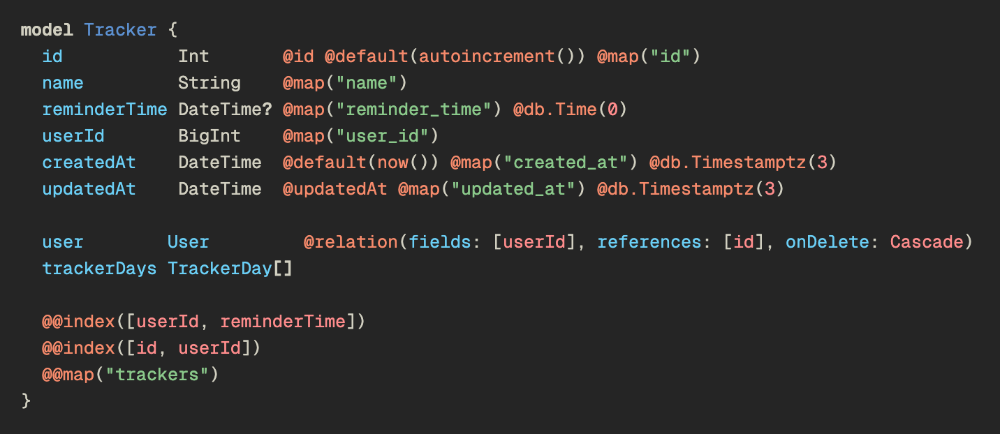

# Vladix Theme

A muted dark pastel theme for VS Code — simple and harmonious, designed for comfortable coding.

## Features

- Dark editor background with subtle line and cursor highlights.
- Distinct colors for functions, variables, and numbers.
- Pastel shades for strings and text.
- Calm blue and purple accents without excessive brightness.
- Separate colors for JSX attributes and JSON keys.

## Color Palette

- **Editor Background:** #252525
- **Foreground / Text:** #D1CFC0
- **Cursor / Accent:** #F67050
- **Strings:** #8AC88A
- **Variables:** #6ACFF6
- **Numbers / Constants:** #FF8C8C
- **Types / Classes:** #5C91D1
- **JSON / Object Keys:** #B79ED9
